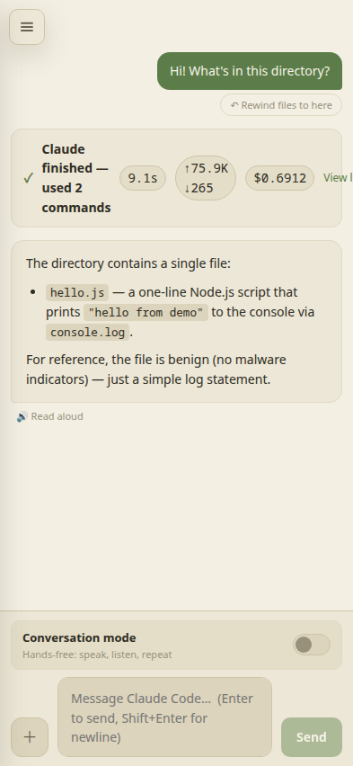
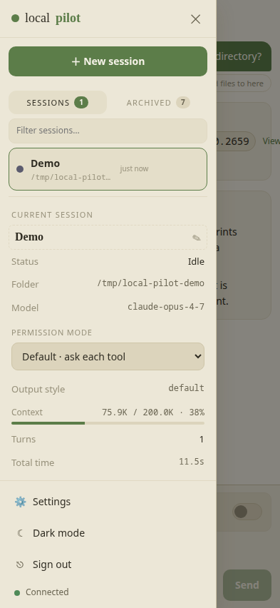
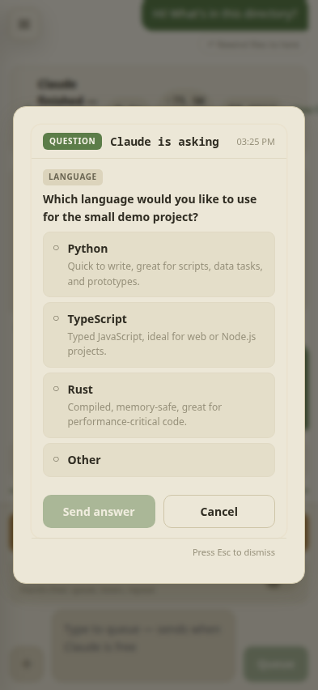
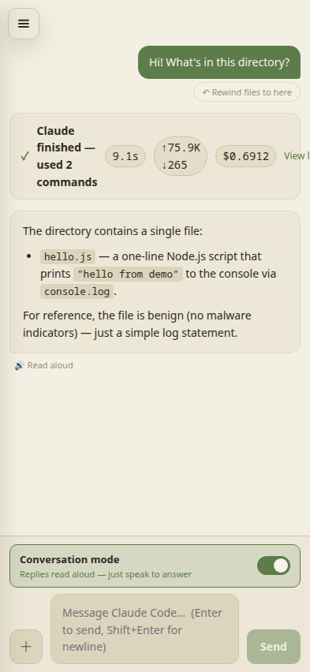
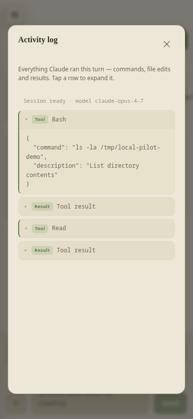
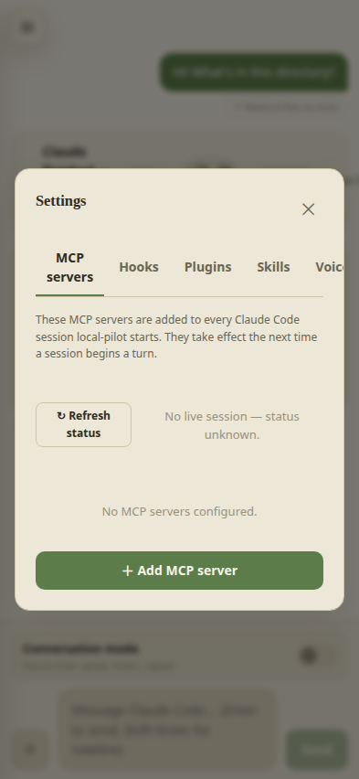

# local-pilot

**Run and control [Claude Code](https://docs.claude.com/en/docs/claude-code) from any browser on your tailnet.**

A small web app that runs on a single box, drives Claude Code through the
Claude Agent SDK, and gives you a mobile-friendly chat UI you can reach from
your phone, tablet, or laptop over [Tailscale](https://tailscale.com/) — no
SSH session held open, no terminal emulator.

---

## What you get

- **Persistent sessions.** Each Claude run lives on the server. Start a task,
  close the tab, reattach from a different device — picks up exactly where
  you left off.
- **Native chat UI** instead of a terminal. Tool calls collapse into a
  per-turn activity log; permission prompts and elicitations render as
  modals with proper allow / deny / answer controls.
- **Multi-session dashboard** with an archive view, in-session search,
  context-window indicator, per-turn token/cost chips, and file-rewind
  ("undo a botched turn").
- **Images and voice.** Drag-drop or paste pictures into chat. Speak to
  Claude with self-hosted Whisper, hear replies in a natural voice with
  self-hosted Piper. A conversation mode loops it hands-free.
- **Push notifications** when a session needs a decision or finishes a
  turn — so you can walk away and come back when there's something to do.

---

## Setup

### Prerequisites

You need all of these on the **host machine** (the box you're running
local-pilot on — usually a Linux server, NAS, or workstation):

| Requirement | Why | Install |
| --- | --- | --- |
| **Node 20+** | Runs the server and builds the UI | `nvm install 20`, or your distro's package manager |
| **`claude` CLI** | local-pilot reuses its login & config — you don't sign into Anthropic again | [Anthropic install docs](https://docs.claude.com/en/docs/claude-code/setup) — then run `claude` once and log in |
| **`systemd`** | For the recommended `--user` service install | Already on most Linux distros |
| **Tailscale** | The only network path into the app | `curl -fsSL https://tailscale.com/install.sh \| sh` |
| **`ffmpeg`** _(optional)_ | Only needed for voice input | `apt install ffmpeg` / `brew install ffmpeg` |

### Install

```sh
git clone https://github.com/DaveForan/local-pilot
cd local-pilot
npm install
npm run service:install
```

That command does four things:

1. Builds the React UI into `web/dist`.
2. Installs a **systemd `--user` service** named `local-pilot`.
3. Generates a random access token into `~/.local-pilot/token` (mode `0600`)
   and **prints it to the terminal** — copy it somewhere safe, you'll
   sign in with it on each device.
4. Starts the service. It binds **`127.0.0.1` only** — never exposed on
   your LAN.

Want it to keep running after you log out and across reboots?

```sh
sudo loginctl enable-linger "$USER"
```

### Expose it on your tailnet

```sh
sudo tailscale serve --bg 8787
```

That gives you an HTTPS URL like `https://<your-host>.<tailnet>.ts.net`.
The HTTPS is what makes push notifications and microphone access work in
the browser — both are blocked on plain HTTP except on `localhost`.

### Sign in

1. From any tailnet device, open `https://<your-host>.<tailnet>.ts.net`.
2. Paste the token printed at install time.
3. The token is exchanged for an `HttpOnly` session cookie — the token
   itself is never stored in the browser.

Lost the token? It's at `~/.local-pilot/token` on the host. Or rotate it
from **Settings → Security → Rotate access token**.

### Add to your phone home screen

Open the URL in **Safari (iOS)** or **Chrome (Android)** → share menu →
**Add to Home Screen**. That gives you a full-screen icon that looks and
behaves like a native app, and means push notifications land in your
notification tray when a session needs you.

### Voice (optional)

Both halves of the conversation loop run on-device — no paid services:

```sh
npm run whisper:install   # speech-to-text (whisper.cpp, base.en model)
npm run piper:install     # text-to-speech (Piper neural voices)
systemctl --user restart local-pilot
```

Without these, the browser's built-in Web Speech API is used as a fallback
— voice still works, just less accurate and more robotic.

### Common commands

```sh
systemctl --user status local-pilot      # is it running?
systemctl --user restart local-pilot     # restart after config changes
journalctl --user -u local-pilot -f      # tail logs
```

---

## Mobile interface

The UI is built mobile-first. A floating hamburger sits over the chat
on the left edge; everything else hides behind it.

<div class="ss-grid" markdown="0">
  <figure>
    
    <figcaption>Chat view: clean paper-tone bubbles, per-turn activity block, send/voice/image buttons in the composer.</figcaption>
  </figure>
  <figure>
    
    <figcaption>Session drawer: tap the floating hamburger to slide it in. Switch sessions, see model + context usage + cost, archive/rename, change permission mode.</figcaption>
  </figure>
  <figure>
    
    <figcaption>Elicitation modal: when Claude asks a question or wants permission, the modal pops over everything so you can't miss it. Multi-choice answers tap-to-pick.</figcaption>
  </figure>
  <figure>
    
    <figcaption>Hands-free conversation mode: mic listens for utterances, replies are read back through Piper TTS, the loop rearms automatically.</figcaption>
  </figure>
  <figure>
    
    <figcaption>Activity log: every command, file edit and tool result Claude ran during a turn. File edits render as proper diffs.</figcaption>
  </figure>
  <figure>
    
    <figcaption>Settings: MCP servers, hooks, plugins, voice picker, push notifications, security (token rotation + backup/restore).</figcaption>
  </figure>
</div>

<p class="ss-note"><em>Screenshots will appear here once they're added to
<code>docs/screenshots/</code>. Until then each tile shows a placeholder
with the expected filename — see
<a href="https://github.com/DaveForan/local-pilot/blob/main/docs/screenshots/README.md">docs/screenshots/README.md</a>
for what to capture.</em></p>

<style>
.ss-grid {
  display: grid;
  grid-template-columns: repeat(auto-fit, minmax(220px, 1fr));
  gap: 18px;
  margin: 22px 0;
}
.ss-grid figure {
  margin: 0;
  background: #f6f8fa;
  border: 1px solid #e1e4e8;
  border-radius: 10px;
  overflow: hidden;
}
.ss-grid img {
  display: block;
  width: 100%;
  height: auto;
  border-bottom: 1px solid #e1e4e8;
  background: #fff;
}
/* When the file is missing, hide the broken-image icon and show a clean
 * placeholder block with the filename instead. */
.ss-grid img.missing {
  aspect-ratio: 9 / 16;
  background:
    repeating-linear-gradient(
      45deg,
      #f6f8fa,
      #f6f8fa 12px,
      #eef0f3 12px,
      #eef0f3 24px
    );
  color: #6a737d;
  font-family: ui-monospace, SFMono-Regular, Menlo, monospace;
  font-size: 14px;
  text-align: center;
  display: flex;
  align-items: center;
  justify-content: center;
  /* Cross-browser way to keep `alt` text visible inside the placeholder
   * (hides the broken-icon glyph on Firefox / Webkit). */
  text-indent: 0;
  object-fit: contain;
}
.ss-grid figcaption {
  padding: 10px 14px;
  font-size: 13px;
  line-height: 1.45;
  color: #444;
}
.ss-note {
  font-size: 13px;
  color: #6a737d;
  background: #f6f8fa;
  border-left: 3px solid #d1d5da;
  padding: 10px 14px;
  border-radius: 4px;
}
</style>

---

## Security model

- **Loopback bind.** The HTTP server listens on `127.0.0.1` only. The only
  way in is `tailscale serve`, so the attack surface is "anyone on your
  tailnet who has your access token".
- **Token-then-cookie.** A 24-byte random access token is generated on
  first start (`~/.local-pilot/token`, mode `0600`). Sign-in exchanges
  the token for an `HttpOnly`, `SameSite=Strict`, `Secure` session
  cookie — the token itself is never stored in the browser. Sessions
  are server-side and revocable.
- **Rate-limited sign-in.** 10 failures per IP per 15 minutes.
- **Rotation built in.** Settings → Security → "Rotate access token"
  issues a new one and invalidates every other device's cookie.

> **What an access token gets you.** Anyone holding it can create a
> session in any directory and have Claude execute tools there — that's
> the whole point of the app. Treat the token like an SSH key. The
> `tailscale serve` gate limits *who can even reach* the login page; the
> token gates the rest.

---

## Configuration

The defaults are sensible. Override via environment variables when
launching the service:

| Variable | Default | Purpose |
| --- | --- | --- |
| `PORT` | `8787` | HTTP / WebSocket port |
| `HOST` | `127.0.0.1` | Bind address — loopback only |
| `LOCAL_PILOT_DATA` | `~/.local-pilot` | Where state is stored |
| `LOCAL_PILOT_DEFAULT_CWD` | `~/Projects` | Default working dir for new sessions |
| `LOCAL_PILOT_TOKEN` | _(auto-generated)_ | Override the access token |
| `LOCAL_PILOT_WHISPER_MODEL` | `base.en` | Whisper model |
| `LOCAL_PILOT_PIPER_VOICE` | `en_US-amy-medium` | Piper voice |

To set them for the systemd service, edit `~/.config/systemd/user/local-pilot.service`
and add `Environment="VAR=value"` lines under `[Service]`, then:

```sh
systemctl --user daemon-reload
systemctl --user restart local-pilot
```

---

## Architecture

```
┌──────────────────────────────────────────────────────────┐
│           Browser (tailnet device, anywhere)             │
│   React + Vite UI · session cookie · WebSocket           │
└────────────────┬─────────────────────────────────────────┘
                 │ HTTPS via `tailscale serve`
┌────────────────▼─────────────────────────────────────────┐
│                local-pilot server (loopback)             │
│  Node + Express · WebSocket hub · auth · push            │
│  SessionManager → one ClaudeRunner per session           │
│  Whisper (STT) · Piper (TTS) spawned on demand           │
└────────────────┬─────────────────────────────────────────┘
                 │ Claude Agent SDK (in-process)
┌────────────────▼─────────────────────────────────────────┐
│   The same Claude Code your `claude` CLI runs.           │
│   Uses your existing login, MCP servers, skills,         │
│   project settings, CLAUDE.md.                           │
└──────────────────────────────────────────────────────────┘
```

---

## Project status

v1 is feature-complete. See the [README](https://github.com/DaveForan/local-pilot)
on GitHub for the changelog.

## License

[MIT](https://github.com/DaveForan/local-pilot/blob/main/LICENSE).

---

_local-pilot is not affiliated with Anthropic. "Claude" and "Claude Code"
are trademarks of Anthropic._
